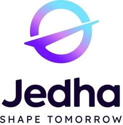
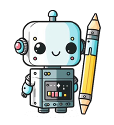

     

*[English translation](#uk-ai-solutions-design-deployment-and-monitoring) follows below.*

> [!WARNING]
> By European standards of the AI Act and considering the topic, putting to production this project based on computer vision would be **strictly forbidden**. As per the notices below, the content provided herein is **exclusively** meant for work applications or for the French certificate RNCP38777. WAKEE is and will remain a student project, without serving a full application online; any other use becomes **your** responsibility alone!

# 
Certification AIA - bloc 4 Construire, déployer et piloter des solutions d'IA :fr:

### 
WAKEE.reloaded: votre assistant personnel pour la concentration

 

*Tous droits intellectuels applicables appartiennent à leurs propriétaires respectifs. Le contenu ici présent est exclusivement mis à disposition dans le cadre du diplôme d'état RNCP38777 ou pour candidature à un emploi.*

Bienvenue dans mon repo dédié à WAKEE.reloaded, votre assistant personnel pour la concentration!

---

### :grey_question: Qu'est-ce que WAKEE?
WAKEE signifie "Work Assistant with Kindness & Emotional Empathy", ou en français "assistant de travail avec gentillesse & empathie émotionnelle". C'est un projet étudiant sur lequel nous quatre (retrouvez-nous dans les [crédits!](#thumbsup-crédits)) avons travaillé durant notre formation en data science & engineering; il se base sur la *computer vision* (vision par ordinateur) autour du thème du TDAH (Trouble du Déficit de l'Attention avec ou sans Hyperactivité), où l'objectif consiste à déceler des marqueurs de dérive cognitive afin d'épauler l'utilisateur dans la reconcentration sur sa tâche.

Tandis que la première version de [WAKEE](https://github.com/JeremyM174/jedhaproject_tdahdetection) consistait en un sprint de deux semaines pour apporter une preuve de concept en data science, le projet revient en tant que **WAKEE.reloaded** pour cette fois mettre en pratique des concepts de data engineering sur une période de trois semaines, au travers de l'automatisation du cycle de vie de la donnée (par son orchestration), ses tâches de CI/CD et son *monitoring*!

---

### :sparkles: Fonctionnalités
* **Reconnaissance d'émotions en temps réel:** en activant votre webcam, WAKEE détectera la présence de marqueurs de dérive cognitive (par le biais des quatre émotions que sont l'ennui, la déconcentration, la confusion et la frustration) grâce à sa technologie de réseau de neurones convolutionnels.

* **Recommandations personnalisées:** grâce au LLM de Mistral, le modèle vous fournira des recommandations adaptées à l'émotion détectée pour vous aider à vous reconcentrer.

* **Sessions de travail:** paramétrez des limites dans la durée de vos session de travail, et consultez leur progrès.

* **Interface de l'application:** une application simple et intuitive réunissant tous les contrôles et fonctionnalités dans un unique écran!

* **Priorité au bien-être:** enfin, WAKEE reste conçu sur une approche empathique. Parfois, une pause est nécessaire et méritée!

---

### :gear: Comment fonctionne WAKEE, et comment le démarrer?
Pour éviter un readme interminable, veuillez consulter le dossier `docs`. (:uk: Documentation en anglais!)

---

### :thumbsup: Crédits
WAKEE est le fruit du travail de quatre passionnés, et même si nous n'aurons pas pu le mener ensemble de bout en bout, il n'existerait pas sans nos contributions respectives!
* [Asma RHALMI](https://github.com/Cauliflaa) (WAKEE)
* [Manon FAEDY](https://github.com/ManonFAEDY) (WAKEE)
* [Albert ROMANO](https://github.com/Ter0rra) (WAKEE & WAKEE.reloaded)
* [Jérémy MARIAGE](https://github.com/JeremyM174) (WAKEE & WAKEE.reloaded)

Et pourtant, rien de tout cela n'aurait été possible sans les travaux dans la vision par ordinateur qui nous ont précédé!
* Gupta A., D’Cunha A., Awasthi K., & Balasubramanian V. (2016): *DAiSEE: Towards User Engagement Recognition in the Wild.* arXiv preprint arXiv:1609.01885.
* Bosch N., D’Mello S., & Ocumpaugh J. (2015): *Detecting student emotions in computer-enabled classrooms.* International Journal of AI in Education.
* Zeng Z., Pantic M., Roisman G.I., & Huang T.S. (2009): *A Survey of Affect Recognition Methods: Audio, Visual, and Spontaneous Expressions.* IEEE TPAMI.

Pour terminer, un grand merci à nos instructeurs & mentors du bootcamp Jedha, ainsi qu'évidemment à l'indispensable et inestimable communauté *open source* qui nous permet de produire de telles preuves de concept!

Bonne exploration! :feet:
  
  
  
---
  
  
  
# 
:uk: AI solutions design, deployment, and monitoring

### 
WAKEE.reloaded: your personal assistant to focus on your task

 

*All applicable intellectual property rights belong to their rightful owners. The content herein displayed is exclusively provided for the sake of the French professional certification RNCP38777 or for job applications.*

Welcome to my repository dedicated to WAKEE.reloaded, your personal assistant to focus on your task!

---

### :grey_question: What is WAKEE?
WAKEE stands for "Work Assistant with Kindness & Emotional Empathy". It is a student project the four of us (find us in the [credits!](#thumbsup-credits)) worked on during our training in data science & engineering; it is based on **computer vision** around the theme of ADHD (Attention Deficit Hyperactivity Disorder), with the objective of detecting markers of cognitive drift to help the user focus on their task at hand.

While the first version of [WAKEE](https://github.com/JeremyM174/jedhaproject_tdahdetection) was a two weeks sprint focused on a proof of concept in data science, the project comes back as **WAKEE.reloaded** to apply data engineering concepts over a period of three weeks and thus, provides the automation of the data lifecycle through orchestration, its CI/CD and monitoring!

---

### :sparkles: Features
* **Real-time emotion recognition:** using your webcam, WAKEE will detect markers of cognitive drift (through the four emotions of boredom, disengagement, confusion & frustration) thanks to the convolutional neural network technology.

* **Personalized recommendations:** thanks to Mistral's LLM, the model will provide you with recommendations depending on the detected emotion to help you focus.

* **Work sessions:** set up timed work sessions and track the progress.

* **Application interface:** a simple and intuitive application gathers all features and controls into a single screen!

* **Focus on well-being:** finally, WAKEE keeps an empathy-driven approach. Sometimes, a pause is needed and well-deserved!

---

### :gear: How does it work, and how to run it?
To avoid a lengthy readme, please refer to the `docs` folder.

---

### :thumbsup: Credits
*Credit where credit is due*: WAKEE is the work of four passionate people, and although we couldn't see it through altogether from start to finish, it wouldn't exist without our respective contributions!
* [Asma RHALMI](https://github.com/Cauliflaa) (WAKEE)
* [Manon FAEDY](https://github.com/ManonFAEDY) (WAKEE)
* [Albert ROMANO](https://github.com/Ter0rra) (WAKEE & WAKEE.reloaded)
* [Jérémy MARIAGE](https://github.com/JeremyM174) (WAKEE & WAKEE.reloaded)

And yet, all this wouldn't have been possible without the works in computer vision that preceded ours!
* Gupta A., D’Cunha A., Awasthi K., & Balasubramanian V. (2016): *DAiSEE: Towards User Engagement Recognition in the Wild.* arXiv preprint arXiv:1609.01885.
* Bosch N., D’Mello S., & Ocumpaugh J. (2015): *Detecting student emotions in computer-enabled classrooms.* International Journal of AI in Education.
* Zeng Z., Pantic M., Roisman G.I., & Huang T.S. (2009): *A Survey of Affect Recognition Methods: Audio, Visual, and Spontaneous Expressions.* IEEE TPAMI.

Finally, many thanks to our instructors & mentors from the Jedha Bootcamp, as well as to the awesome open-source community who give us the opportunity to create such proofs of concept!

Have fun exploring! :feet: