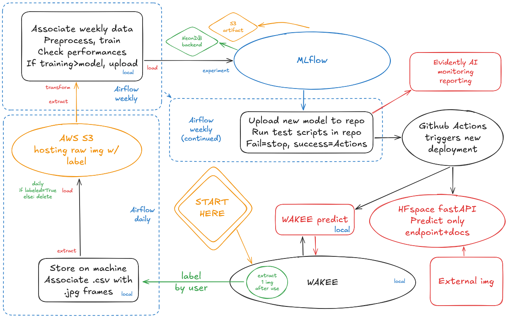

# 
WAKEE.reloaded documentation

### Table of contents

1. [Pre-requisites](#1-pre-requisites-top)
2. [Understanding the architecture](#2-understanding-the-architecture-top)
3. [Starting the system](#3-starting-the-system-top)
4. [Limits and improvements](#4-limits-and-improvements-top)
5. [Technical stack](#5-technical-stack-top)
6. [Afterword](#6-afterword-top)

> [!WARNING]
> As a reminder by European standards of the AI Act - [article 5.1.f](https://eur-lex.europa.eu/legal-content/EN/TXT/?uri=CELEX:32024R1689#art_5), putting either WAKEE, either WAKEE.reloaded into production is **strictly forbidden** and becomes **your** sole responsibility. Doing so **isn't intended** by any of us; sharing our project is only meant to help us with work applications, as well as a requirement for our French certificate RNCP38777 "AI Architect"!

---

### 1. Pre-requisites [:top:](#wakeereloaded-documentation)

WAKEE.reloaded is meant to run with:
* Anaconda Navigator,
* Anaconda Prompt,
* Docker.

Given the topic of regulations, we go by the principle the reader is aware of their purpose and use to (hopefully) prevent the misuse by at least some non-initiated users, to prevent any headache consequently.

Please note WAKEE.reloaded is heavily impacted by performance: given the real-time detection, it is meant to run on computers with higher specs - at least having a GPU. Obviously, it also requires having a webcam and enabling access to it through its local application (remember to check permissions within both your operating system and your internet browser).

Now for the actual steps to be performed before any use:

1. Build your environment (we used Anaconda Navigator to manage it); you may find a convenient `wakee_rldd_backup.yaml` file to that end.
2. Activate the new environment (if you kept its default name) with `conda activate wakee_rldd`.
3. `cd` to the path where you've extracted the project; it should end with `WAKEE.reloaded`. Keep it open for later.
4. Make sure Docker is running and ready to build; keep it open as well.
5. Finally, create and fill your `.env` file ( :heavy_exclamation_mark: never share your credentials!) by following the example given in `.env_example.md` as follows:

* [AWS](https://aws.amazon.com/fr/): AWS_ACCESS_KEY_ID, AWS_SECRET_ACCESS_KEY (your user credentials to access AWS) --- S3_BUCKET_URI (the full s3 URI of your bucket: `s3://...`) --- S3_BUCKET_NAME, S3_WORK_FOLDER (from your S3 interface, exclusively the *names* of your bucket and the working folder contained within: `my-wakee-bucket` & `my-working-folder`) --- ARTIFACT_STORE_URI (the full s3 URI under which ML artifacts will be stored: `s3://...`)
* [NeonDB](https://neon.com/docs/get-started/connect-neon) (or any host for your relational database, we used PostgreSQL): SQL_NEONDB_URI (optional: **deprecated** back-up URI `postgresql://...`) --- BACKEND_STORE_URI (full URI necessary to run MLflow: `postgresql://`)
* [Mistral API](https://docs.mistral.ai/getting-started/quickstart): MISTRAL_API_KEY (your private API key)
* [Evidently AI](https://docs.evidentlyai.com/quickstart_ml): EVIDENTLY_API_KEY (your private API key) --- EVIDENTLY_AI_PROJECT_ID (the unique ID of the Evidently project enabling monitoring)
* MLflow (we hosted ours on a [HuggingFace space](https://huggingface.co/docs/hub/spaces)): TRACKING_SERVER_URI (full address: `https://...`)

Should you not have an account on any of the services above, the links provided will take you to their documentation.

---

### 2. Understanding the architecture [:top:](#wakeereloaded-documentation)

WAKEE.reloaded incorporates multiple elements, some being available only locally, others in the cloud.

WAKEE in itself is meant to run locally for multiple reasons; chief amongst them being, to prevent the ease in porting it to a convenient live application, going against regulations.

When we refer only to "WAKEE", it is the script which can only be run on your localhost, bringing your web browser up. This is where the user begins: the convenient interface enables them to start or stop the real-time capture through their webcam, setting their work sessions on the left-hand side, and getting recommendations (upon detection of cognitive drift) on the right-hand side.

  

Using deep learning means (through a convolutional neural network), emotions are recognized; those are boredom, engagement (where unlike the others, we rely on lower scores to detect *dis*engagement), confusion and frustration. When appropriate, LLM prompt engineering produces recommendations to help the user focus again.

Whenever the user turns off their webcam, WAKEE will prompt them with one of the captured frames, asking them to rate their own emotions. This is where we get our new labeled data through human feedback!

  

Then begins the part that the user is not expected to be aware of: WAKEE.reloaded, involving the variety of functionalities making the model live behind our project.

Airflow orchestration begins with a daily DAG, enabling the writing of a .csv file associating the labels provided by the users to their .jpg frame. Should the frame miss its ratings, it will be deleted; otherwise it is hosted on a S3 bucket as-is.

This ends the daily orchestration (lower left on the schema); it is only meant to prepare the weekly training, while removing daily any leftover and/or unused data.

  

Then begins the first half of the weekly DAG (upper left on schema). The new data gathered daily is compiled once a week, before starting a new model training; its results are stored into an MLflow run, allowing us to track its results.

Should the new challenger model perform better than the champion in use, this is where the second half of the weekly DAG (center of the schema) starts: the new model is uploaded in the dedicated repository of WAKEE.reloaded. Using GitHub Actions, test scripts are run; should they all be passed, the continuous deployment part of the project will go through by updating all models in use.

As they deteriorate over time, Evidently AI will be put to practice to monitor how WAKEE's model performs, and will raise the alert in case of something crossing thresholds.

  

Now completely out of the DAGs, the end user is able to make use of the latest update of WAKEE's model!

Following our certificate's instructions, we were also expected to deploy an API online to serve our model and provide documentation for it. Though technically available to meet this criteria on a [HuggingFace space](https://mevelios-wakee-reloaded-api.hf.space/), it remains unadvertised on the root README for obvious reasons. Running on free resources, the space may take up to 120 seconds to restart; it won't permit real-time detection since it tolerates at most two calls per minute. Data sent to the API endpoint will not be stored; it is only meant to be run on the model to return a result, then discarded.

---

### 3. Starting the system [:top:](#wakeereloaded-documentation)

* Starting WAKEE:

Bring back up your Anaconda Prompt window; it should still have the `wakee_rldd` environment active, running under the `\WAKEE.reloaded` folder.

Type `cd src` to move into this folder, then type `streamlit run app.py`; it will bring up your web browser and open a localhost tab.

There it is; give it a minute to boot up, and you'll be within WAKEE's local application to start using it!

  

* Running WAKEE.reloaded's system:

In a terminal window, move back to the root folder of the project `\WAKEE.reloaded`. Docker should still be open and ready to build; in the terminal, you should now type `docker-compose up airflow-init`. This will start (or download) the services revolving around Airflow and ensure the loading of your environment variables.

Give it some time; your terminal will become interactible again once this step is over. If you have your port mapping in head, try to remember whether your localhost:8081 is available - otherwise skip to the next part.

Past that point and while your terminal is still in `\WAKEE.reloaded`, now type `docker-compose up --build`; you'll be assailed by system messages booting up all services. Give it some time again for your Airflow instance to start properly; when you'll see a successful health message ressembling `airflow-scheduler-1  | 127.0.0.1 - - [19/Mar/2026 19:06:32] "GET /health HTTP/1.1" 200 -`, you'll know Airflow is available although your terminal will now be locked. I'll leave you to choose whether you prefer passing the flag to keep it interactible; leaving it locked serves as a reminder for me that the service is still running!

Now open your web browser and simply access your localhost through the following address: `http://localhost:8081`. You're in! There is no account setting performed here, since we won't put it to production; thus the account & password are simply `airflow` in both fields.

Should the service not start, your port 8081 may not be available. Please check the `docker-compose.yaml` file in the root and edit the line 129 (under the airflow-webserver service) with any available port of your choice, restart the steps above and access the proper port when typing your `http://localhost:` address.

Anyway, Airflow's interface is very intuitive with toggles on the left-hand side to turn on/off its DAGs. The two of them (daily & weekly) will trigger all the underlying code to perform the tasks described in the architecture above!

To stop the service, if you still have the (now locked) terminal window open, simply hit ctrl+c. Otherwise in a new terminal window within the root folder of this project, type `docker-compose down`; this is it!

Several ways exist to delete a container; I'll leave you to choose how far you intend on going by checking [Docker's documentation](https://docs.docker.com/engine/manage-resources/pruning/)!

---

### 4. Limits and improvements [:top:](#wakeereloaded-documentation)

As a proof of concept, WAKEE.reloaded is far from being perfect. We met several limitations:

* Our training data itself. To avoid heavy costs on training, we resorted to the "DAiSEE small" version of the original dataset; this in turn came with many caveats. Data distribution in our labels remains heavily skewed towards certain values.

* The model performance. In computer vision, every pixel matters; there is no exception when dealing with people. As the DAiSEE dataset we trained our model on references Indian students, caracteristics such as age, sex or skin color (to quote the "easiest" in a lengthy list) make our model heavily underperform on profiles that do not match our training data.

* The computation performance. The code is far from being optimal, yet it relies on advanced technologies; it takes higher computer specs to run efficiently. On our equipment, we managed at most to analyse in a stable manner four frames per second, while most of us were stuck with one frame per second.

On the other hand, many improvements could be brought to WAKEE.reloaded:

* Bucket cleaning. Right now, our DAGs do not implement an orchestrated removal of the daily uploaded frames and their .csv files; since the application is only meant to be run locally, we only have to clean after ourselves - so we chose to do it manually, given WAKEE.reloaded will **never** be put to production.

* Preventing data poisoning. Again since we expected little use and only locally for demonstration purposes, there are no reports produced to check on the fresher data provided; we only prevent partial ratings, still data poisoning would be easy to perform.

* And many more, such as enabling the user to access our prompt engineering to provide a chatbot for their own questions unrelated to the project, or improving the work sessions to include checkpoints set by the user. Still, WAKEE.reloaded will remain a proof of concept for a student project and won't be further developed!

---

### 5. Technical stack [:top:](#wakeereloaded-documentation)

WAKEE.reloaded was made possible through a wide array of tools:

* Python code,
* PyTorch for deep learning,
* ONNX for model compression,
* OpenCV for frame capture,
* Pillow for image processing,
* LangChain for LLM interaction with Mistral's models;
 

* Docker for virtualization,
* Airflow for orchestration,
* MLflow for ML experiment logging,
* Evidently for monitoring;
 

* GitHub for version control and assistance with the continuous deployment,
* HuggingFace for hosting & deploying applications,
* AWS (Amazon Web Services) for data storage,
* NeonDB for providing PostgreSQL databases.

Last but not least, all dependencies and versioning can be found within the root `wakee_rldd_backup.yaml` file!

---

### 6. Afterword [:top:](#wakeereloaded-documentation)

Less of a technical read and more of a personal final word, as much as WAKEE.reloaded cannot and will not be taken farther, I dare think as the owner of this repository that I wouldn't impersonate my fellow co-learners in saying that all four of us are proud of what we produced.

WAKEE & WAKEE.reloaded may not be operating as best as it could, but it never were the intention. We started with near-zero knowledge of data or coding in general, and look at us one year later: we produced a proof of concept relying on advanced machine learning technologies to start a new chapter in our careers!

The [Jedha bootcamp](https://www.jedha.co/) spanned over a period of nearly a semester. It was an intense experience during which we've learned a lot, so I would like again to thank our instructors and mentors whom accompanied us - even though for confidentiality I won't name them, I hope they will recognize themselves and wish them the best!

One more round of thanks for the exceptional open source community, which enables so many possibilities to develop new projects, experiment new concepts, and simply allows us to flourish even with little means. You're wonderful, ladies & gents!

Another round of thanks for my fellow co-learners: Asma, Manon, Albert. We held our ground throughout our training, had our own challenges, and yet - we've made it. Now that's one hell of a success, innit?! :satisfied:

And finally, for you reader - thank you too for taking the time to read through this documentation! :wink: