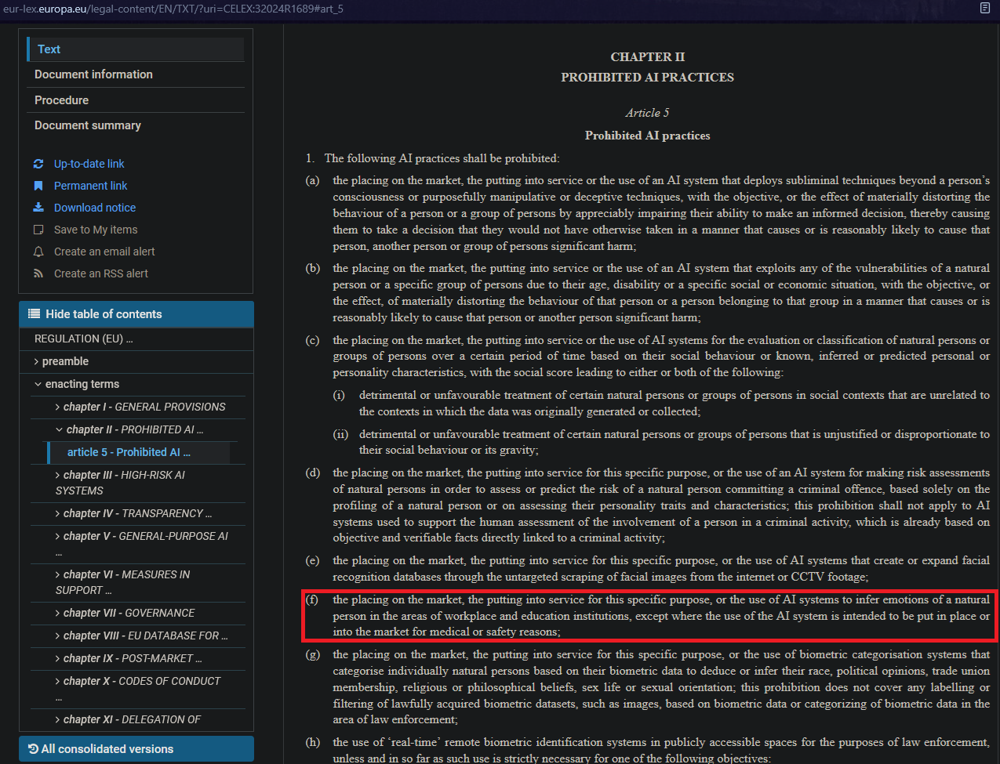

A brief focus on regulations, given the topic of the EU AI Act; please scroll down to find the screenshot of the precise article restricting any use made of our project.

Both WAKEE and WAKEE.reloaded are projects revolving around computer vision, with the aim to infer emotions as markers of cognitive drift. As such, our projects are immediately within the scope of the AI Act article 5.1.f, which forbids any form of machine learning (part of the definition of an "AI system" - please refer to article 3) with such an aim. To quote the crucial part:

"[...] the use of AI systems to infer emotions of a natural person in the areas of workplace and education institutions, [...]"

During our training and before even agreeing on the topic to work on, we formed our student group with one principle: our project would **never** be meant for profit. Sharing WAKEE and WAKEE.reloaded is only intended for work applications or in relation to our French certificates RNCP35288 "Machine learning engineer" & RNCP38777 "AI architect".

By reading the article 5.1.f, you may notice the exception clause:

"[...] except where the use of the AI system is intended to be put in place or into the market for medical or safety reasons;"

To my knowledge, nobody amongst the four of us who worked on WAKEE (and subsequently WAKEE.reloaded) have had this approach, and we never intended regardless to put it into production (hence the lack of a convenient online app). While the idea of providing it to non-profit organizations did cross our imagination (as ADHD is increasingly diagnosed even amongst adults), in the end we never made that step.

Should you want to reuse our project, it entirely becomes **your** responsibility and enters into conflict with our original intent!

Please refer to the screenshot below to read the article, otherwise use [this link](https://eur-lex.europa.eu/legal-content/EN/TXT/?uri=CELEX:32024R1689#art_5) to the official EU AI Act!

